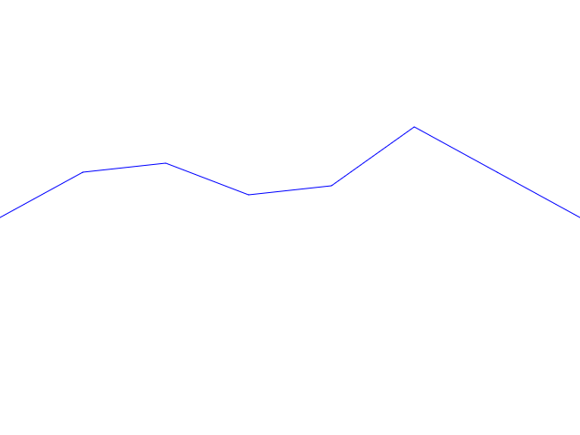

# Barista

A cafeinated 2d canvas rendering engine. 
You can use Barista for: 

- Create video games. 
- Create amazing data visualization tools.
- Create RIA (rich internet applications) like drawing apps.
- Funky filters.

... Etc ... Etc ...

# Getting Started

Open a terminal and type the following instructions:
```bash
git clone https://github.com/thetinyspark/barista
cd barista
npm install
npm start
```

# Technical stack

- The entire project is written in Typescript: https://www.typescriptlang.org/.
- The unit test framework is Jasmine: https://jasmine.github.io/..
- The project uses webpack as module bundler: https://webpack.js.org/.
- The documentation is generated by typedoc: https://typedoc.org/.

# Documentation

Barista is a pedagogic project initiated by the Moocaccino community: 

- The technical documentation is in the "docs" directory. 
- You can follow the whole creation process, on the youtube channel: https://www.youtube.com/channel/UChURQuW24XwekTrbvjgY7WA. 
- If you don't like videos, you cand find a complete set of tutorials on http://moocaccino.fr/.
- Don't hesitate to ask for help on the discord: https://discordapp.com/invite/WUfVsrz

# Exercices 

## Exercice 1: Draw a Kirby with canvas API

This exercise is quite simple, you just have to draw a Kirby by using canvas API calls. 
Specifically, the ones you've learn in episode 2 & 3 on the moocaccino youtube channel. 
For those who don't know, Kirby is a very cute pink alien designed by Nintendo, your result 
should look like this: 


Have fun !

## Exercice 2: Draw a curve which represents variation throught time

This exercise is more about data visualization, you have to draw a curve 
which represents the following datas throught time: 
```typescript
const data = [
    {amount: 0, time: 0},
    {amount: 10, time: 5},
    {amount: 12, time: 10},
    {amount: 5, time: 15},
    {amount: 7, time: 20},
    {amount: 20, time: 25},
    {amount: 10, time: 30},
    {amount: 0, time: 35}
]; 
```

The result should look like this : 



## Solutions 

The solution for the curve exercise is on the index.ts file, but try by yourself before!
